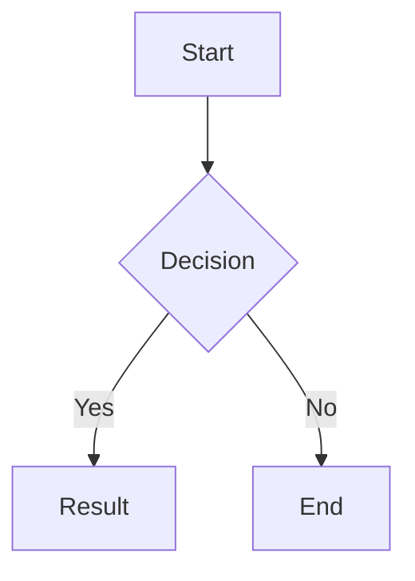

[**English**](README.md) | [中文](README.zh.md)

# Zhi

A minimal Hugo blog theme with dark/light mode, MathJax, Mermaid diagrams, Bilibili/YouTube video shortcodes, image lightbox, and code copy — built with pure Hugo Pipes, zero external build tools.

## Features

- **Dark / Light Theme** — Toggle with system preference detection and \`localStorage\` persistence → [docs](docs/en/theme-switch.md)
- **Syntax Highlighting** — Hugo's built-in Chroma with copy button and language label → [docs](docs/en/code-highlight.md)
- **MathJax 3** — Auto-loaded when \`$...$\$ or \`$$...$$\$ detected in page content → [docs](docs/en/mathjax.md)
- **Mermaid Diagrams** — Auto-loaded when \` ```mermaid \` code blocks exist; theme-aware (dark/light) → [docs](docs/en/mermaid.md)
- **Video Shortcode** — Embed Bilibili or YouTube with automatic geo-switching (timezone-based) and manual toggle → [docs](docs/en/video.md)
- **Image Lightbox** — Click any article image to view full-size overlay → [docs](docs/en/lightbox.md)
- **Responsive Design** — Mobile-first, max-width `768px` content area
- **Custom Analytics** — Configurable endpoint with sampling support → [docs](docs/en/analytics.md)
- **Hugo Pipes** — All CSS/JS processed via `resources.Get` → `minify` → `fingerprint`, no webpack/vite

## Requirements

- Hugo **≥ 0.146.0** (non-extended is fine)

## Quick Start

### As a Hugo Theme Module (recommended)

In your site's `hugo.toml`:

```toml
[module]
  [[module.imports]]
    path = "github.com/mickeyzzc/hugo-theme-zhi"
```

### As a Git Clone

```bash
git clone https://github.com/mickeyzzc/hugo-theme-zhi.git themes/zhi
```

Then in your site's `hugo.toml`:

```toml
theme = 'zhi'
```

## Configuration

```toml
[params.features]
  codeHighlight = true   # Syntax highlighting
  mathJax       = true   # Math rendering ($...$, $$...$$)
  mermaid       = true   # Mermaid diagrams
  themeSwitch   = true   # Dark/light toggle button
  lightbox      = true   # Click-to-zoom images
  analytics     = true   # Custom analytics endpoint

[params.analytics]
  provider   = "custom"
  endpoint   = "/metrics"
  siteId     = ""
  sampleRate = 100

[params.video]
  defaultPlatform = "bilibili"   # "bilibili" or "youtube"
  showSwitch      = true         # Show platform toggle button

[params.theme]
  default = "auto"   # "auto", "light", or "dark"
```

## Documentation

Comprehensive bilingual documentation for all features:

| Feature | English | 中文 |
|---------|---------|------|
| Analytics | [docs](docs/en/analytics.md) | [文档](docs/zh-cn/analytics.md) |
| Archives | [docs](docs/en/archives.md) | [文档](docs/zh-cn/archives.md) |
| Back to Top | [docs](docs/en/back-to-top.md) | [文档](docs/zh-cn/back-to-top.md) |
| Code Highlight | [docs](docs/en/code-highlight.md) | [文档](docs/zh-cn/code-highlight.md) |
| Creative Commons | [docs](docs/en/creative-commons.md) | [文档](docs/zh-cn/creative-commons.md) |
| Donation | [docs](docs/en/donation.md) | [文档](docs/zh-cn/donation.md) |
| Footer | [docs](docs/en/footer.md) | [文档](docs/zh-cn/footer.md) |
| Friend Links | [docs](docs/en/friend-links.md) | [文档](docs/zh-cn/friend-links.md) |
| Greeting | [docs](docs/en/greeting.md) | [文档](docs/zh-cn/greeting.md) |
| Lightbox | [docs](docs/en/lightbox.md) | [文档](docs/zh-cn/lightbox.md) |
| MathJax | [docs](docs/en/mathjax.md) | [文档](docs/zh-cn/mathjax.md) |
| Mermaid | [docs](docs/en/mermaid.md) | [文档](docs/zh-cn/mermaid.md) |
| Pagination | [docs](docs/en/pagination.md) | [文档](docs/zh-cn/pagination.md) |
| Reading Progress | [docs](docs/en/reading-progress.md) | [文档](docs/zh-cn/reading-progress.md) |
| Search | [docs](docs/en/search.md) | [文档](docs/zh-cn/search.md) |
| SEO | [docs](docs/en/seo.md) | [文档](docs/zh-cn/seo.md) |
| Shortcodes Note | [docs](docs/en/shortcodes-note.md) | [文档](docs/zh-cn/shortcodes-note.md) |
| Shortcodes Quote | [docs](docs/en/shortcodes-quote.md) | [文档](docs/zh-cn/shortcodes-quote.md) |
| Sidebar | [docs](docs/en/sidebar.md) | [文档](docs/zh-cn/sidebar.md) |
| Tag Cloud | [docs](docs/en/tag-cloud.md) | [文档](docs/zh-cn/tag-cloud.md) |
| Theme Switch | [docs](docs/en/theme-switch.md) | [文档](docs/zh-cn/theme-switch.md) |
| TOC | [docs](docs/en/toc.md) | [文档](docs/zh-cn/toc.md) |
| Typography | [docs](docs/en/typography.md) | [文档](docs/zh-cn/typography.md) |
| Video | [docs](docs/en/video.md) | [文档](docs/zh-cn/video.md) |

## Usage

> For complete documentation, see [Documentation](#documentation).


```

Embed Bilibili and/or YouTube videos. When both IDs are provided, the player auto-selects based on timezone (China → Bilibili, else → config default). Users can manually switch platforms.

### Mermaid Diagrams

Use a fenced code block with the `mermaid` language:

~~~markdown

~~~

### Math / LaTeX

Inline: `$E = mc^2$`

Display:
```markdown
$$
\int_{-\infty}^{\infty} e^{-x^2} dx = \sqrt{\pi}
$$
```

### Code Blocks

All fenced code blocks automatically get:
- Language label (top-left)
- Copy button (top-right)
- Hugo Chroma syntax highlighting

```markdown
```python
def hello():
    print("Hello, World!")
```
```

### Menus

```toml
[[menus.main]]
  name = 'Home'
  pageRef = '/'
  weight = 10

[[menus.main]]
  name = 'Posts'
  pageRef = '/posts'
  weight = 20
```

### Social Links

```toml
[[params.social]]
  name = "GitHub"
  url = "https://github.com/yourusername"

[[params.social]]
  name = "Twitter"
  url = "https://twitter.com/yourusername"
```

## Project Structure

```
layouts/
├── _default/          # baseof.html, single.html, list.html, _markup/
├── _partials/         # Hugo 0.120+ partials (head, header, footer, menu, terms)
├── partials/          # Legacy (mathjax.html, mermaid.html)
├── shortcodes/        # video.html
├── home.html          # Homepage template
├── 404.html           # Standalone 404 (no baseof)
├── section.html       # Section list
├── taxonomy.html      # Taxonomy overview
└── term.html          # Taxonomy term page

assets/
├── css/
│   ├── main.css               # Aggregator via @import
│   └── components/            # Per-feature CSS modules
│       ├── theme.css          # CSS variables (light + dark)
│       ├── header.css
│       ├── footer.css
│       ├── code.css
│       ├── video.css
│       ├── lightbox.css
│       ├── mermaid.css
│       └── math.css
└── js/
    ├── main.js               # Orchestrator (MathJax + Mermaid lazy-load)
    ├── code-copy.js           # Copy button for code blocks
    ├── theme-toggle.js        # Dark/light toggle with persistence
    ├── video-geo-switch.js    # Bilibili/YouTube geo-switching
    └── lightbox.js            # Image lightbox overlay
```

## Development

```bash
# Start dev server with live reload
hugo server

# Production build
hugo --minify

# Run E2E tests
npx playwright test
```

## Theme System

Theme colors are defined as CSS custom properties in `assets/css/components/theme.css`:

```css
:root {
  --bg: #ffffff;
  --text: #222222;
  --accent: #0066cc;
  /* ... */
}

[data-theme="dark"] {
  --bg: #1a1a1a;
  --text: #e0e0e0;
  --accent: #4da6ff;
  /* ... */
}
```

Override these variables in your site's own CSS to customize colors.

## License

MIT
