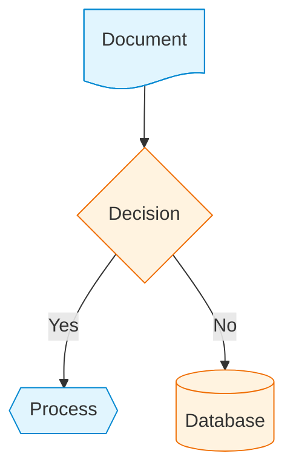

[**English**](README.md) | [中文](README.zh.md)

# Zhi

A minimal Hugo blog theme with dark/light mode, MathJax, Mermaid diagrams, Bilibili/YouTube video shortcodes, image lightbox, and code copy — built with pure Hugo Pipes, zero external build tools.

     

## Features

- **Dark / Light Theme** — Toggle with system preference detection and `localStorage` persistence → [docs](docs/en/features.md#theme-switch)
- **Syntax Highlighting** — Hugo's built-in Chroma with copy button and language label → [docs](docs/en/content.md#code-highlight)
- **MathJax 3** — Auto-loaded when `$...$` or `$$...$$` detected in page content → [docs](docs/en/content.md#mathjax)
- **Mermaid v11+ Diagrams** — Auto-loaded when ` ```mermaid ` code blocks exist; supports expanded node shapes (`@{ shape: ... }`), `classDef` styling, ELK layout, architecture/kanban diagrams; theme-aware (dark/light) → [docs](docs/en/content.md#mermaid)
- **Video Shortcode** — Embed Bilibili or YouTube with automatic geo-switching (timezone-based) and manual toggle → [docs](docs/en/content.md#video)
- **Image Lightbox** — Click any article image to view full-size overlay → [docs](docs/en/features.md#image-lightbox)
- **Responsive Design** — Mobile-first, max-width `768px` content area
- **Custom Analytics** — Configurable endpoint with sampling support → [docs](docs/en/configuration.md#analytics)
- **Hugo Pipes** — All CSS/JS processed via `resources.Get` → `minify` → `fingerprint`, no webpack/vite
- **Multilingual / i18n** — Language switcher with automatic translation linking → [docs](docs/en/features.md#language-switcher)
- **Series Taxonomy** — Post series with stepper layout, sort toggle, and weight-based ordering → [docs](docs/en/features.md#series)

## Requirements

- Hugo **≥ 0.146.0** (non-extended is fine)

## Quick Start

### As a Hugo Theme Module (recommended)

In your site's `hugo.toml`:

```toml
[module]
  [[module.imports]]
    path = "github.com/mickeyzzc/hugo-theme-zhi"
```

### As a Git Clone

```bash
git clone https://github.com/mickeyzzc/hugo-theme-zhi.git themes/zhi
```

Then in your site's `hugo.toml`:

```toml
theme = 'zhi'
```

## Configuration

```toml
[params.features]
  codeHighlight = true   # Syntax highlighting
  mathJax       = true   # Math rendering ($...$, $$...$$)
  mermaid       = true   # Mermaid diagrams
  themeSwitch   = true   # Dark/light toggle button
  lightbox      = true   # Click-to-zoom images
  analytics     = true   # Custom analytics endpoint
  series       = true   # Post series with sort toggle
[params.analytics]
  provider   = "custom"
  endpoint   = "/metrics"
  siteId     = ""
  sampleRate = 100

[params.video]
  defaultPlatform = "bilibili"   # "bilibili" or "youtube"
  showSwitch      = true         # Show platform toggle button

[params.theme]
  default = "auto"   # "auto", "light", or "dark"
}

[taxonomies]
  series = "series"
```

## Documentation

Comprehensive bilingual documentation for all features:

| Category | English | 中文 |
|----------|---------|------|
| Features | [docs](docs/en/features.md) | [文档](docs/zh-cn/features.md) |
| Content | [docs](docs/en/content.md) | [文档](docs/zh-cn/content.md) |
| Configuration | [docs](docs/en/configuration.md) | [文档](docs/zh-cn/configuration.md) |

## Usage

> For complete documentation, see [Documentation](#documentation).


```

Embed Bilibili and/or YouTube videos. When both IDs are provided, the player auto-selects based on timezone (China → Bilibili, else → config default). Users can manually switch platforms.

### Mermaid Diagrams (v11+)

Use a fenced code block with the `mermaid` language. Supports all Mermaid v11+ features including expanded node shapes and `classDef` styling:

~~~markdown

```mermaid
graph TD
    A@{ shape: doc, label: "Document" } --> B@{ shape: diam, label: "Decision" }
    B -->|Yes| C@{ shape: hex, label: "Process" }
    B -->|No| D@{ shape: cyl, label: "Database" }

    classDef primary fill:#e1f5fe,stroke:#0288d1
    classDef warn fill:#fff3e0,stroke:#ef6c00
    class A,C primary
    class B,D warn
```
~~~

Supported diagram types: `flowchart`, `sequence`, `class`, `state`, `ER`, `gantt`, `pie`, `mindmap`, `timeline`, `gitgraph`, `architecture` (v11.1+), `kanban` (v11.0+), and more.

### Math / LaTeX

Inline: `$E = mc^2$`

Display:
```markdown
$$
\int_{-\infty}^{\infty} e^{-x^2} dx = \sqrt{\pi}
$$
```

### Code Blocks

All fenced code blocks automatically get:
- Language label (top-left)
- Copy button (top-right)
- Hugo Chroma syntax highlighting

```markdown
```python
def hello():
    print("Hello, World!")
```
```

### Menus

```toml
[[menus.main]]
  name = 'Home'
  pageRef = '/'
  weight = 10

[[menus.main]]
  name = 'Posts'
  pageRef = '/posts'
  weight = 20

[[menus.main]]
  name = 'Series'
  pageRef = '/series'
  weight = 30
```

### Social Links

```toml
[[params.social]]
  name = "GitHub"
  url = "https://github.com/yourusername"

[[params.social]]
  name = "Twitter"
  url = "https://twitter.com/yourusername"
```

## Project Structure

```
layouts/
├── _default/          # baseof.html, single.html, list.html, _markup/
├── _partials/         # Hugo 0.120+ partials (head, header, footer, menu, terms, lang-switch, greeting, tag-cloud)
├── partials/          # Legacy (mathjax.html, mermaid.html)
├── shortcodes/        # video.html
├── archives/           # Archives page
├── flinks/             # Friend links page
├── series/             # Series taxonomy pages
├── home.html, section.html, taxonomy.html, term.html

assets/
├── css/
│   ├── main.css               # Aggregator via @import
│   └── components/            # Per-feature CSS modules
│       ├── theme.css          # CSS variables (light + dark)
│       ├── header.css
│       ├── footer.css
│       ├── code.css
│       ├── video.css
│       ├── lightbox.css
│       ├── mermaid.css
│       ├── math.css
│       ├── lang-switch.css
│       ├── series.css
│       ├── greeting.css
│       └── tag-cloud.css
└── js/
    ├── main.js               # Orchestrator (MathJax + Mermaid lazy-load)
    ├── code-copy.js           # Copy button for code blocks
    ├── theme-toggle.js        # Dark/light toggle with persistence
    ├── video-geo-switch.js    # Bilibili/YouTube geo-switching
    ├── lightbox.js            # Image lightbox overlay
    ├── sidebar.js
    ├── greeting.js
    ├── search.js
    ├── toc.js
    ├── reading-progress.js
    ├── back-to-top.js
    ├── donation.js
    ├── analytics.js
    └── series-sort.js
```

## Development

```bash
# Start dev server with live reload
hugo server

# Production build
hugo --minify

# Run E2E tests
npx playwright test
```

## Theme System

Theme colors are defined as CSS custom properties in `assets/css/components/theme.css`:

```css
:root {
  --bg: #ffffff;
  --text: #222222;
  --accent: #0066cc;
  /* ... */
}

[data-theme="dark"] {
  --bg: #1a1a1a;
  --text: #e0e0e0;
  --accent: #4da6ff;
  /* ... */
}
```

Override these variables in your site's own CSS to customize colors.

## License

MIT
