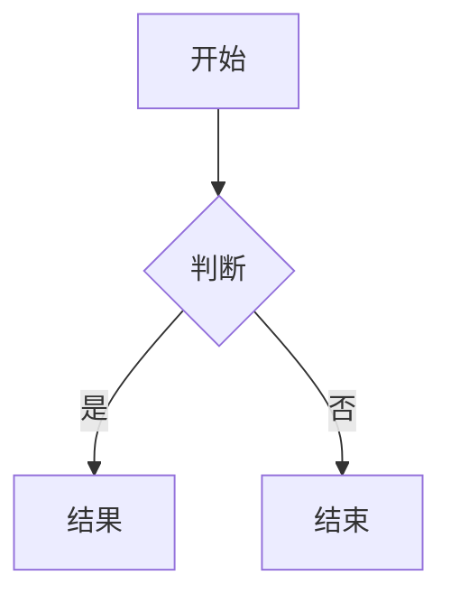

[English](README.md) | **中文**

# Zhi

一个极简的 Hugo 博客主题，支持深色/浅色主题、MathJax、Mermaid 图表、哔哩哔哩/YouTube 视频短代码、图片灯箱和代码复制 —— 使用纯 Hugo Pipes 构建，零外部构建工具。

## 功能特性

- **深色 / 浅色主题** — 系统偏好检测 + `localStorage` 持久化 → [文档](docs/zh-cn/features.md#主题切换)
- **语法高亮** — Hugo 内置 Chroma，支持复制按钮和语言标签 → [文档](docs/zh-cn/content.md#代码高亮)
- **MathJax 3** — 检测到 `$...$` 或 `$$...$$` 时自动加载 → [文档](docs/zh-cn/content.md#mathjax)
- **Mermaid 图表** — 检测到 ` ```mermaid ` 代码块时自动加载，自适应深色/浅色 → [文档](docs/zh-cn/content.md#mermaid-图表)
- **视频短代码** — 嵌入哔哩哔哩或 YouTube，基于时区自动切换，支持手动切换 → [文档](docs/zh-cn/content.md#视频嵌入)
- **图片灯箱** — 点击文章图片查看大图 → [文档](docs/zh-cn/features.md#图片灯箱)
- **响应式设计** — 移动优先，内容区最大宽度 `768px`
- **网站分析** — 可配置端点，支持采样率 → [文档](docs/zh-cn/configuration.md#网站分析)
- **Hugo Pipes** — 所有 CSS/JS 通过 `resources.Get` → `minify` → `fingerprint` 处理，无需 webpack/vite

## 环境要求

- Hugo **≥ 0.146.0**（非 Extended 版本即可）

## 快速开始

### 作为 Hugo 主题模块（推荐）

在你的 `hugo.toml` 中：

```toml
[module]
  [[module.imports]]
    path = "github.com/mickeyzzc/hugo-theme-zhi"
```

### 作为 Git Clone

```bash
git clone https://github.com/mickeyzzc/hugo-theme-zhi.git themes/zhi
```

然后在你的 `hugo.toml` 中：

```toml
theme = 'zhi'
```

## 配置

```toml
[params.features]
  codeHighlight = true   # 语法高亮
  mathJax       = true   # 数学公式 ($...$, $$...$$)
  mermaid       = true   # Mermaid 图表
  themeSwitch   = true   # 深色/浅色切换按钮
  lightbox      = true   # 点击图片放大
  analytics     = true   # 自定义分析端点

[params.analytics]
  provider   = "custom"
  endpoint   = "/metrics"
  siteId     = ""
  sampleRate = 100

[params.video]
  defaultPlatform = "bilibili"   # "bilibili" 或 "youtube"
  showSwitch      = true         # 显示平台切换按钮

[params.theme]
  default = "auto"   # "auto"、""light" 或 "dark"
```

## 文档

所有功能的完整双语文档：

| 分类 | English | 中文 |
|------|---------|------|
| 功能 | [docs](docs/en/features.md) | [文档](docs/zh-cn/features.md) |
| 内容 | [docs](docs/en/content.md) | [文档](docs/zh-cn/content.md) |
| 配置 | [docs](docs/en/configuration.md) | [文档](docs/zh-cn/configuration.md) |

## 用法

> 完整文档请参阅[文档](#文档)。

### 视频短代码

```markdown

```

嵌入哔哩哔哩和/或 YouTube 视频。当同时提供两个 ID 时，播放器根据时区自动选择（中国 → 哔哩哔哩，其他 → 配置默认值）。用户可手动切换平台。

### Mermaid 图表

使用 `mermaid` 语言的围栏代码块：

~~~markdown

~~~

### 数学公式 / LaTeX

行内公式：`$E = mc^2$`

块级公式：
```markdown
$$
\int_{-\infty}^{\infty} e^{-x^2} dx = \sqrt{\pi}
$$
```

### 代码块

所有围栏代码块自动具备：
- 语言标签（左上角）
- 复制按钮（右上角）
- Hugo Chroma 语法高亮

```markdown
```python
def hello():
    print("Hello, World!")
```
```

### 菜单

```toml
[[menus.main]]
  name = '首页'
  pageRef = '/'
  weight = 10

[[menus.main]]
  name = '文章'
  pageRef = '/posts'
  weight = 20
```

### 社交链接

```toml
[[params.social]]
  name = "GitHub"
  url = "https://github.com/yourusername"

[[params.social]]
  name = "Twitter"
  url = "https://twitter.com/yourusername"
```

## 项目结构

```
layouts/
├── _default/          # baseof.html、single.html、list.html、_markup/
├── _partials/         # Hugo 0.120+ partials（head、header、footer、menu、terms）
├── partials/          # 旧版（mathjax.html、mermaid.html）
├── shortcodes/        # video.html
├── home.html          # 首页模板
├── 404.html           # 独立 404 页面（不使用 baseof）
├── section.html       # Section 列表
├── taxonomy.html       # 分类概览
└── term.html          # 分类术语页

assets/
├── css/
│   ├── main.css               # 通过 @import 聚合
│   └── components/            # 按功能划分的 CSS 模块
│       ├── theme.css          # CSS 变量（浅色 + 深色）
│       ├── header.css
│       ├── footer.css
│       ├── code.css
│       ├── video.css
│       ├── lightbox.css
│       ├── mermaid.css
│       └── math.css
└── js/
    ├── main.js               # 编排器（MathJax + Mermaid 懒加载）
    ├── code-copy.js           # 代码块复制按钮
    ├── theme-toggle.js        # 深色/浅色切换及持久化
    ├── video-geo-switch.js    # 哔哩哔哩/YouTube 地域切换
    └── lightbox.js            # 图片灯箱
```

## 开发

```bash
# 启动开发服务器（支持热重载）
hugo server

# 生产构建
hugo --minify

# 运行 E2E 测试
npx playwright test
```

## 主题系统

主题颜色通过 `assets/css/components/theme.css` 中的 CSS 自定义属性定义：

```css
:root {
  --bg: #ffffff;
  --text: #222222;
  --accent: #0066cc;
  /* ... */
}

[data-theme="dark"] {
  --bg: #1a1a1a;
  --text: #e0e0e0;
  --accent: #4da6ff;
  /* ... */
}
```

在你自己的站点 CSS 中覆盖这些变量即可自定义颜色。

## 许可证

MIT
