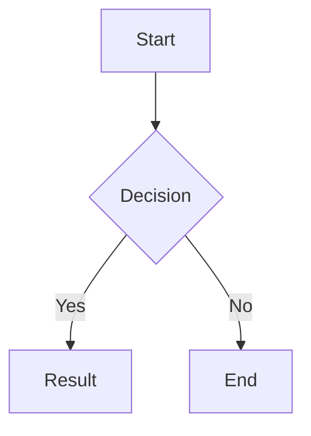

# Content

> Content rendering features and shortcodes.

## Table of Contents

- [MathJax](#mathjax)
- [Mermaid](#mermaid)
- [Video](#video)
- [Shortcodes](#shortcodes)
- [Code Highlight](#code-highlight)
- [Typography](#typography)

---

## MathJax

MathJax 3 for rendering LaTeX math expressions. Auto-loaded when `$...$` or `$$...$$` detected in page content.

### Overview

This feature automatically loads MathJax 3 when it detects LaTeX math expressions in your content (either inline `$...$` or display `$$...$$`). It enables beautiful mathematical typesetting without any special configuration.

### Configuration

```toml
[params.features]
  mathJax = true  # Default: true
```

### Usage

This feature requires no special markup in content. It automatically:
- Loads MathJax 3 when inline `$...$` or display `$$...$$` math is detected
- Supports both inline and display math modes
- Works with Hugo's Markdown rendering

Inline: `$E = mc^2$`

Display:
```markdown
$$
\int_{-\infty}^{\infty} e^{-x^2} dx = \sqrt{\pi}
$$
```

---

## Mermaid

Mermaid diagram rendering. Auto-loaded when ```mermaid code blocks exist; theme-aware (dark/light).

### Overview

This feature automatically loads Mermaid when it detects Mermaid diagram code blocks in your content. It supports various diagram types including flowcharts, sequence diagrams, class diagrams, and state diagrams, with automatic theme adaptation (light/dark).

### Configuration

```toml
[params.features]
  mermaid = true  # Default: true
```

### Usage

This feature requires no special markup in content. It automatically:
- Loads Mermaid when ```mermaid code blocks are detected
- Supports flowchart, sequence diagram, class diagram, state diagram, etc.
- Adapts to current theme (light/dark) via CSS variables



---

## Video

Bilibili/YouTube video shortcode with automatic geo-switching (timezone-based) and manual toggle.

### Overview

This feature provides a video shortcode that embeds Bilibili or YouTube videos with automatic geo-switching based on the user's timezone (China → Bilibili, else → configured default). Users can manually switch platforms if enabled.

### Configuration

```toml
[params.video]
  defaultPlatform = "bilibili"   # "auto" | "bilibili" | "youtube" (default: "bilibili")
  showSwitch      = true         # Show platform toggle button in video player (default: true)
```

### Usage

Use the video shortcode in content:

```markdown

```

- When both `bilibili` and `youtube` IDs are provided:
  - Auto-selects based on timezone (China → Bilibili, else → `defaultPlatform`)
  - User can manually switch platforms if `showSwitch = true`
- When only one ID is provided, that platform is used
- Optional `title` parameter for video title

---

## Shortcodes

### Quote

Display a quote with optional author and source.

#### Configuration

No special configuration required. The shortcode is available by default.

#### Usage

```markdown

Quote content here

```

Both author and source are optional. If provided, they will be displayed below the quote.

### Note

Display styled note boxes with different types and optional titles.

#### Configuration

No special configuration required. The shortcode is available by default.

#### Usage

```markdown

Content here

```

Types: info, tip, success, warning, danger. Each type has a unique SVG icon.
The title is optional and defaults to the type name if not provided.

---

## Code Highlight

Syntax highlighting via Hugo's built-in Chroma with copy button and language label. Uses Monokai style by default.

### Overview

This feature provides syntax highlighting for code blocks using Hugo's built-in Chroma highlighter. It includes a copy button and language label for each code block.

### Configuration

```toml
[params.features]
  codeHighlight = true  # Default: true

[markup.highlight]
  codeFences       = true
  noClasses        = false
  lineNumbersInTable = true
  style            = "monokai"
  tabWidth         = 2
```

### Usage

This feature requires no special markup in content. All fenced code blocks automatically get:
- Language label (top-left)
- Copy button (top-right)
- Hugo Chroma syntax highlighting

```markdown
```python
def hello():
    print("Hello, World!")
```
```

---

## Typography

Customize fonts for heading, body, and code.

### Configuration

```toml
[params.typography]
  headingFont = ""
  bodyFont = ""
  codeFont = ""
  lineScale = 1.6
  cjkLineScale = 1.8
```

### Usage

Set the font variables to your desired font family (e.g., "Arial", "'Helvetica Neue'", etc.).
An empty string uses the system font stack.
Adjust `lineScale` and `cjkLineScale` for line height (default 1.6 for Latin, 1.8 for CJK).
