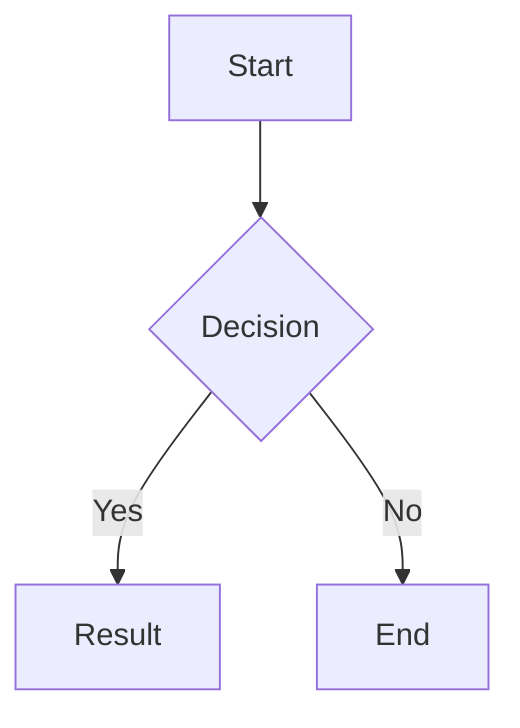

# Mermaid

Mermaid diagram rendering. Auto-loaded when ```mermaid code blocks exist; theme-aware (dark/light).

## Overview

This feature automatically loads Mermaid when it detects Mermaid diagram code blocks in your content. It supports various diagram types including flowcharts, sequence diagrams, class diagrams, and state diagrams, with automatic theme adaptation (light/dark).

## Configuration

```toml
[params.features]
  mermaid = true  # Default: true
```

## Usage

This feature requires no special markup in content. It automatically:
- Loads Mermaid when ```mermaid code blocks are detected
- Supports flowchart, sequence diagram, class diagram, state diagram, etc.
- Adapts to current theme (light/dark) via CSS variables



## Related

- [Theme Switch](../en/theme-switch.md)
- [Code Highlight](../en/code-highlight.md)