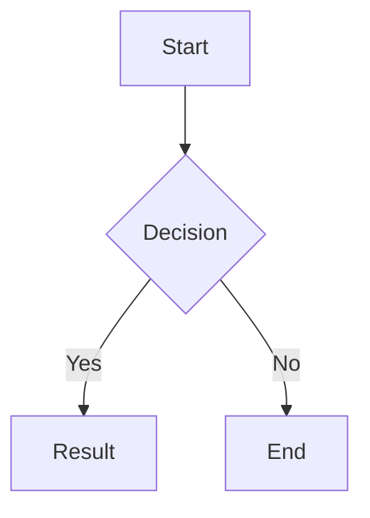

# 内容

> 内容渲染功能和短代码。

## 目录

- [MathJax](#mathjax)
- [Mermaid 图表](#mermaid-图表)
- [视频嵌入](#视频嵌入)
- [短代码](#短代码)
- [代码高亮](#代码高亮)
- [字体定制](#字体定制)

---

## MathJax

数学公式渲染功能，使用 MathJax 3 自动加载行内和块级公式。

### 配置

```toml
[params.features]
  mathJax = true          # 启用 MathJax
```

### 用法

- 行内公式：`$E = mc^2$`
- 块级公式：
  $$
  \int_{-\infty}^{\infty} e^{-x^2} dx = \sqrt{\pi}
  $$
- 系统会自动检测页面中的 `$...$` 和 `$$...$$` 并加载 MathJax。

---

## Mermaid 图表

Mermaid 图表功能，自动加载并渲染 ```mermaid 代码块，支持主题自适应。

### 配置

```toml
[params.features]
  mermaid = true          # 启用 Mermaid 图表
```

### 用法

使用带有 `mermaid` 语言的围栏代码块：

~~~markdown

~~~

系统会自动检测页面中的 ```mermaid 块并加载 Mermaid 库。

---

## 视频嵌入

视频短代码功能，支持 Bilibili 和 YouTube，自动根据时区选择平台并提供手动切换。

### 配置

```toml
[params.video]
  defaultPlatform = "bilibili"   # "bilibili" 或 "youtube"
  showSwitch      = true         # 显示平台切换按钮
```

### 用法

使用短代码嵌入视频：



- 当同时提供 bilibili 和 youtube ID 时，根据访问者的时区自动选择（中国大陆使用 Bilibili，否则使用默认平台）。
- 用户可以通过切换按钮手动选择平台。

---

## 短代码

### Quote

显示带有可选作者和来源的引用。

#### 配置

无需特殊配置。该短代码默认可用。

#### 用法

```markdown

引用内容这里

```

作者和来源都是可选的。如果提供，它们将显示在引用下方。

### Note

显示带有不同类型和可选标题的样式化笔记框。

#### 配置

无需特殊配置。该短代码默认可用。

#### 用法

```markdown

内容这里

```

类型：info, tip, success, warning, danger。每种类型都有独特的 SVG 图标。
标题是可选的，如果未提供则默认为类型名称。

---

## 代码高亮

语法高亮功能，使用 Hugo 的 Chroma 实现，带复制按钮和语言标签。

### 配置

```toml
[params.features]
  codeHighlight = true          # 启用语法高亮

[markup]
  [markup.highlight]
    codeFences = true           # 启用代码围栏
    guessSyntax = true          # 猜测语法
    hl_Lines = ""               # 高亮行号
    lineNoStart = 1             # 行号起始值
    lineNos = true              # 显示行号
    lineNumbersInTable = true   # 使用表格显示行号
    noClasses = false           # 使用 CSS 类而非内联样式
    style = "monokai"           # 高亮样式（如 monokai, github）
    tabWidth = 2                # 制表符宽度
```

### 用法

所有围栏代码块（```language）自动获得：
- 语言标签（左上角）
- 复制按钮（右上角）
- 行号（如果启用）
- 主题样式（默认 Monokai）

```python
def hello():
    print("Hello, World!")
```

---

## 字体定制

自定义标题、正文和代码的字体。

### 配置

```toml
[params.typography]
  headingFont = ""
  bodyFont = ""
  codeFont = ""
  lineScale = 1.6
  cjkLineScale = 1.8
```

### 用法

将字体变量设置为您想要的字体系列（例如，"Arial"，"'Helvetica Neue'" 等）。
空字符串使用系统字体栈。
调整 `lineScale` 和 `cjkLineScale` 以设置行高（拉丁文默认为 1.6，CJK 默认为 1.8）。
