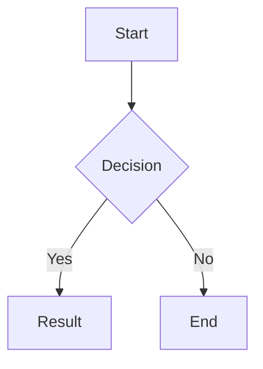

# Mermaid 图表

Mermaid 图表功能，自动加载并渲染 ```mermaid 代码块，支持主题自适应。

## 配置

```toml
[params.features]
  mermaid = true          # 启用 Mermaid 图表
```

## 用法

使用带有 `mermaid` 语言的围栏代码块：

~~~markdown

~~~

系统会自动检测页面中的 ```mermaid 块并加载 Mermaid 库。

## 相关链接

- [代码高亮](../en/code-highlight.md)
- [MathJax](../en/mathjax.md)