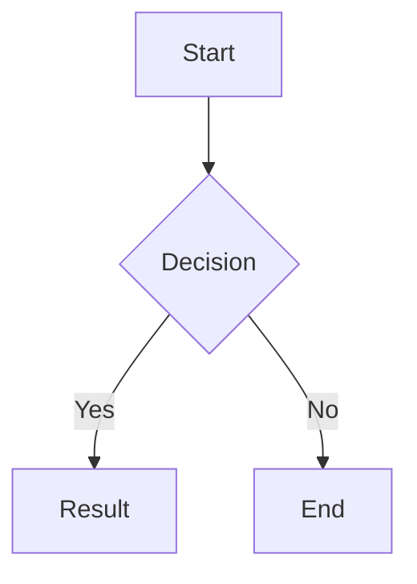

Welcome to the Zhi theme demo! This is a simple blog theme for Hugo.

## Features

- Dark/light theme toggle
- Code highlighting with copy button
- MathJax support
- Mermaid diagrams
- Video embedding (Bilibili/YouTube)
- Image lightbox
- Responsive design

## Code Example

```python
def hello(name: str) -> str:
    return f"Hello, {name}!"

print(hello("World"))
```

## Math

Inline math: $E = mc^2$

Display math:

$$
\int_{-\infty}^{\infty} e^{-x^2} dx = \sqrt{\pi}
$$

## Mermaid Diagram



## Image


## Video


