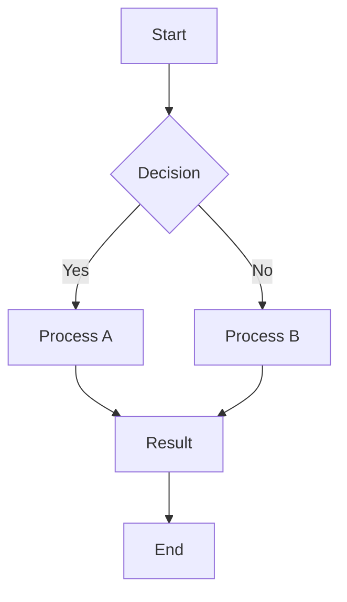
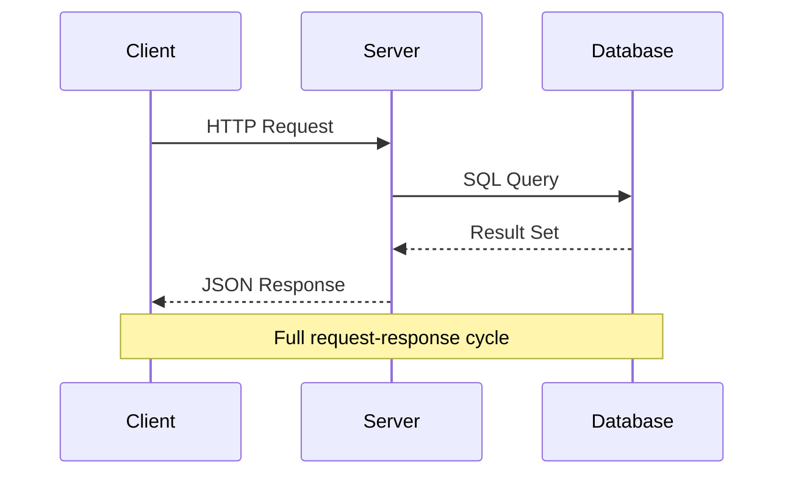
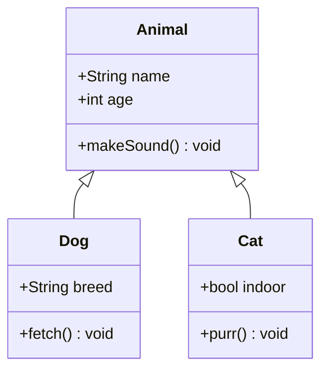
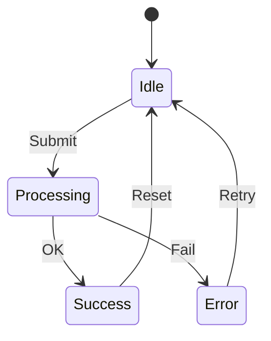
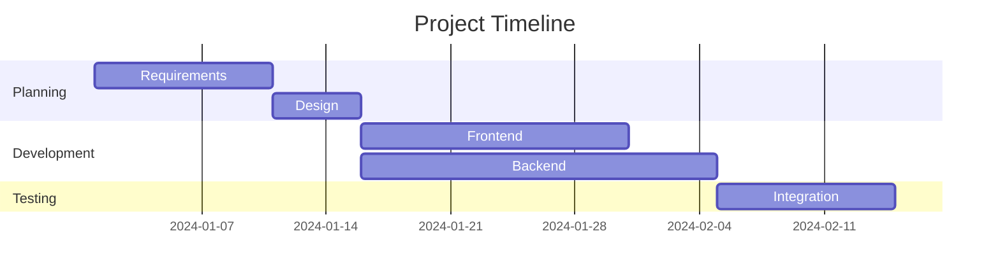
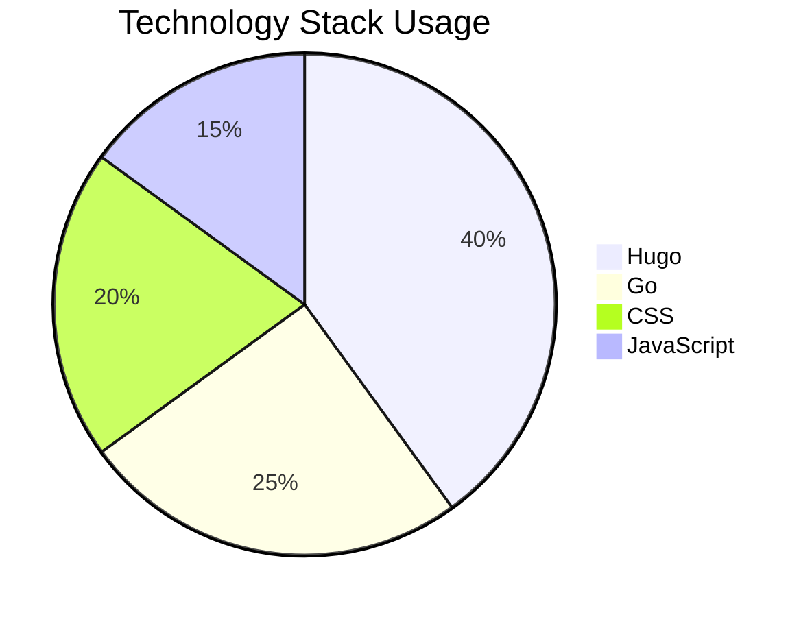

## Flowchart

```mermaid
graph TD
    A[Start] --> B{Decision}
    B -->|Yes| C[Process A]
    B -->|No| D[Process B]
    C --> E[Result]
    D --> E
    E --> F[End]
```

## Sequence Diagram

```mermaid
sequenceDiagram
    participant Client
    participant Server
    participant Database

    Client->>Server: HTTP Request
    Server->>Database: SQL Query
    Database-->>Server: Result Set
    Server-->>Client: JSON Response

    Note over Client,Database: Full request-response cycle
```

## Class Diagram

```mermaid
classDiagram
    class Animal {
        +String name
        +int age
        +makeSound() void
    }
    class Dog {
        +String breed
        +fetch() void
    }
    class Cat {
        +bool indoor
        +purr() void
    }
    Animal <|-- Dog
    Animal <|-- Cat
```

## State Diagram

```mermaid
stateDiagram-v2
    [*] --> Idle
    Idle --> Processing : Submit
    Processing --> Success : OK
    Processing --> Error : Fail
    Success --> Idle : Reset
    Error --> Idle : Retry
```

## Gantt Chart

```mermaid
gantt
    title Project Timeline
    dateFormat YYYY-MM-DD
    section Planning
        Requirements    :a1, 2024-01-01, 10d
        Design          :a2, after a1, 5d
    section Development
        Frontend        :b1, after a2, 15d
        Backend         :b2, after a2, 20d
    section Testing
        Integration     :c1, after b2, 10d
```

## Pie Chart

```mermaid
pie title Technology Stack Usage
    "Hugo" : 40
    "Go" : 25
    "CSS" : 20
    "JavaScript" : 15
```
